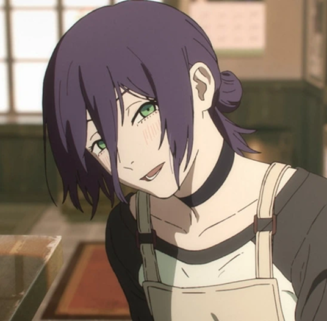
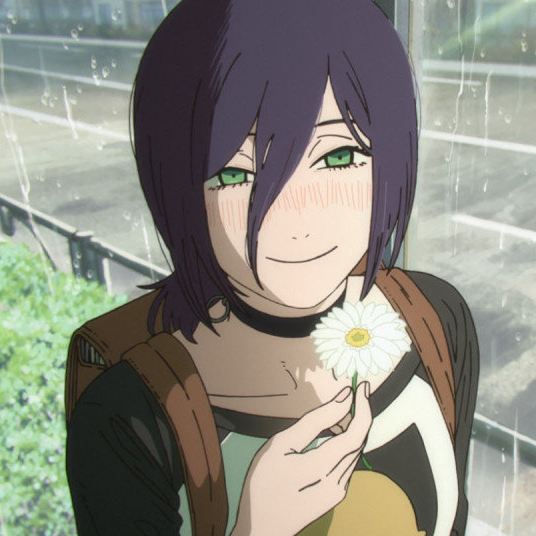

<header><h2>
        
        <picture>
        <source media="(prefers-color-scheme: dark)" 
                srcset="basic/title_dark-theme.svg">
        <source media="(prefers-color-scheme: light)" 
                srcset="title_whilte-theme.svg">
        
        </picture>
        </h2>
</header>
<section>
<h3>Stack</h3>
<ul>
<li>designing (Figma, Affinity)</li>
<li>Playing piano</li>
</ul>
</section>
<section>

</section>
<section style="margin-top: 20px">
<h3>Social</h3>
        

        
        
        
        

</section>
<section>
<h3>Reze</h3>

</section>
